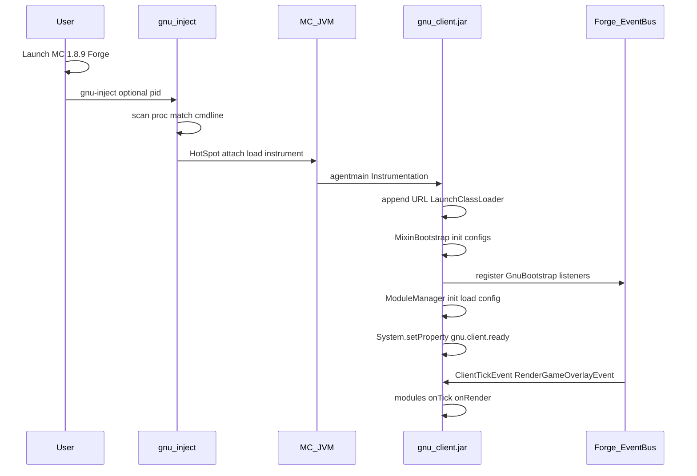
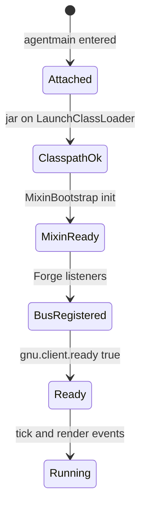
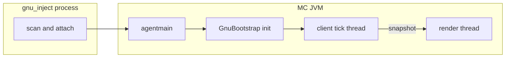

# GNUClient Architecture

Authoritative design for an **injectable Forge 1.8.9 client** on Linux. The system is split into a small **C++ injector** (`gnu-inject`) and a **Java payload JAR** (`gnu-client.jar`) loaded into a **running** Minecraft JVM. All game logic, hooks, rendering, and GUI live in Java.

**Document status:** Approved architecture — implementation blocked until explicit go-ahead after this file is reviewed.

---

## 1. Overview

### Superseded design

The following approach is **retired** and must not be revived without a new decision:

| Retired | Replacement |
|---------|-------------|
| `LD_PRELOAD` + `libGNUClient.so` | HotSpot dynamic attach + JAR agent |
| `-agentpath` on the launcher | Same — not the primary inject path |
| Native JNI module loop in C++ | Forge event bus + Java modules |
| Compiled `mapping.cpp` / JNI field caches | MCP-deobfuscated Java against Forge MDK |
| ImGui in native `.so` | Custom LWJGL overlay in the JAR |
| `rain.jar.ready` / native JVMTI bytecode agents | `gnu.client.ready` + Mixin in the JAR |

`LD_PRELOAD` polluted every child process a launcher spawned, fought Prism’s environment inheritance, and tied rendering to a native library that could not safely initialize before the JVM was ready. The injectable JAR model attaches **only** to the target MC JVM after Forge has started.

### End-to-end flow

1. The user starts Minecraft 1.8.9 Forge normally (e.g. PrismLauncher).
2. The user runs **`gnu-inject`** (or it auto-selects the MC process).
3. The injector scans `/proc` for a JVM whose cmdline matches Forge/LaunchWrapper/Minecraft.
4. The injector uses the **HotSpot attach protocol** to load `gnu-client.jar` as a **Java agent** into that PID.
5. The agent’s **`agentmain`** runs on an attach thread, appends the JAR to `LaunchClassLoader`, initializes **Mixin 0.7.11**, and boots **`GnuBootstrap`**.
6. Bootstrap registers on **`MinecraftForge.EVENT_BUS`**, constructs **`ModuleManager`**, loads config, and sets **`gnu.client.ready=true`**.
7. Modules receive **tick**, **render**, and **packet** callbacks; the custom LWJGL GUI draws on overlay events.



### High-level components

| Component | Language | Responsibility |
|-----------|----------|----------------|
| `gnu-inject` | C++ | Find MC JVM, HotSpot attach, load agent JAR |
| `gnu-client.jar` | Java | Mixin patches, modules, config, GUI, render |
| Forge / LaunchWrapper | Java (game) | Classloader, deobfuscated MC, event bus |

---

## 2. C++ injector (`gnu-inject`)

### Role

`gnu-inject` is the **only** native binary users run to activate GNUClient. It does not contain module logic. It finds the correct process and asks the JVM to load `gnu-client.jar` via the standard **dynamic attach** mechanism—the same facility underlying `com.sun.tools.attach.VirtualMachine`.

### Finding the Minecraft JVM

Scan **`/proc/[pid]/`** for candidate processes:

| Check | Purpose |
|-------|---------|
| `/proc/pid/maps` contains `libjvm.so` | Process is a JVM |
| `/proc/pid/cmdline` readable | Build full argument string (NUL → space) |

**Match** if cmdline contains **any** of:

- `launchwrapper` (Forge LW classpath)
- `minecraft-1.8.9` (client JAR path segment, Prism layout)
- `jre-legacy` (Prism bundled JRE path)
- `net.minecraftforge` / `minecraftforge` / `--tweakClass` / `cpw.mods.fml` (broader Forge heuristics, as in RainClient `process_scanner.cpp`)

**Reject** processes that are:

- Generic `java` tools (`-version`, Gradle daemons, IDE backends)
- Prism/Qt helpers without `libjvm.so`
- Attach listeners from unrelated JVMs

When multiple matches exist, list PIDs and cmdline prefixes; auto-select if exactly one; otherwise prompt (Rain `main.cpp` pattern).

### Attach mechanism: primary vs alternatives

#### Primary: HotSpot attach socket (C++, in-process protocol)

**Choice:** Implement the attach protocol directly in C++, mirroring proven code in `RainClient/injector/src/jvm_attach.cpp`.

**Steps:**

1. **`ensure_attach_listener(pid)`** — create `/proc/pid/cwd/.attach_pid{pid}` or `/tmp/.attach_pid{pid}`, send **SIGQUIT**, wait for `/tmp/.java_pid{pid}` UNIX socket (up to ~10s).
2. **`connect`** to the attach socket.
3. Write the HotSpot **`load`** command for a **Java agent**:
   - Agent library name: **`instrument`** (loads `libinstrument.so`, not the JAR path as a `.so`)
   - Flag: **`false`** (JAR path is not an absolute-path native agent)
   - Options: **absolute path to `gnu-client.jar`**
4. Read the response; line 1 = protocol status; line 2 = **agent return code** (`0` = OK, `102` = `agentmain` failed).

**Why this is primary:**

| Benefit | Explanation |
|---------|-------------|
| No second JVM | Unlike spawning `java -jar attach.jar`, does not require a JDK tool on PATH |
| Same as `tools.jar` | Official attach API; stable across HotSpot 8 used by 1.8.9 |
| In-repo proof | RainClient already ships working attach load for JAR + native agents |
| Least privilege | No `/proc/pid/mem` writes, no injected shellcode, compatible with W^X |

#### Fallback: subprocess attach tools

For debugging only:

```bash
# Example — requires JDK with attach API on PATH
jattach <pid> load instrument false /path/to/gnu-client.jar
```

Or a tiny Java helper using `VirtualMachine.attach(String.valueOf(pid)).loadAgent(jarPath)`.

Use when validating attach failures; **not** the shipped default.

#### Rejected: JVMTI remote `dlopen` / shellcode

RainClient’s native **`libRain.so`** path used attach-time `dlopen` of a JVMTI agent. For GNUClient v1 this is **explicitly rejected**:

- Duplicates the old native-client architecture the project is leaving
- Fragile under **`-XX:+DisableAttachMechanism`**, SELinux, and hardened kernels
- Harder to audit than `instrument` + manifest agent
- Mixing shellcode attach with a **Java-first** payload adds no benefit

### Binary layout and path resolution

Install tree:

```
install/
  bin/gnu-inject
  lib/gnu-client.jar
```

Resolve JAR default path from injector location:

```cpp
// Conceptual — mirror Rain resolve_exe_install_root()
// /proc/self/exe → .../bin/gnu-inject → parent → install/
// default jar = install_root / "lib" / "gnu-client.jar"
```

### CLI interface

```
gnu-inject [--pid PID] [--jar /absolute/path/to/gnu-client.jar]
```

| Flag | Behavior |
|------|----------|
| `--pid PID` | Inject into that PID after validating cmdline + `libjvm.so` |
| (none) | Scan; auto-select single match; else interactive list |
| `--jar PATH` | Override default `lib/gnu-client.jar` |

**Exit codes:**

| Code | Meaning |
|------|---------|
| 0 | Attach OK, agent response OK |
| 1 | Usage error, JAR not found, no matching process |
| 2 | Attach listener/socket failure |
| 3 | Agent loaded but `agentmain` failed (attach response code 102) |

**Example session:**

```text
$ gnu-inject
GNU Inject — scanning for Forge 1.8.9 JVM...
  [127729] /home/lev/.../jre-legacy/bin/java ... launchwrapper ... minecraft-1.8.9 ...
Auto-selected PID 127729
Injecting gnu-client.jar...
Attach response: 0
Agent return: 0
Success. Check logs: gnu.client.ready should be true in-game.
```

---

## 3. LaunchClassLoader injection

Forge 1.8.9 runs under **LaunchWrapper**. Game classes load through **`net.minecraft.launchwrapper.Launch.classLoader`** (`LaunchClassLoader`). GNUClient must run **inside** that loader’s namespace so module code sees deobfuscated Minecraft and Forge types.

### Hot attach (primary): running game

When the user injects **after** the main menu or in-world:

1. JVM invokes **`agentmain(String agentArgs, Instrumentation inst)`** from the JAR manifest (`Agent-Class`).
2. Agent verifies **`Launch.classLoader`** is non-null (poll briefly if attach happens during early startup).
3. Append **`gnu-client.jar`** to the launch classpath:
   - Prefer **`URLClassLoader.addURL`** on `Launch.classLoader` via reflection, **or**
   - **`Instrumentation.appendToSystemClassLoaderSearch(JarFile)`** when appropriate for agent JAR visibility.
4. Load **`gnu.bootstrap.GnuBootstrap`** from that loader and call **`GnuBootstrap.init(inst)`**.

```java
// Conceptual agentmain sequence
public static void agentmain(String args, Instrumentation inst) {
    ClassLoader lw = Launch.classLoader;
    if (lw == null) throw new IllegalStateException("LaunchClassLoader null");
    addJarToClassLoader(lw, jarPathFromArgsOrCodeSource());
    MixinBootstrap.init();
    Mixins.addConfiguration("mixins.gnuclient.json");
    Class<?> bootstrap = Class.forName("gnu.bootstrap.GnuBootstrap", true, lw);
    bootstrap.getMethod("init", Instrumentation.class).invoke(null, inst);
}
```

### Cold path (optional): LaunchWrapper tweaker

For dev runs where the JAR is on the tweak list **before** main:

| Mechanism | When |
|-----------|------|
| **`ITweaker`** | `injectIntoClassLoader` registers transformers; `getLaunchArguments` adjusts args |
| Manifest `TweakClass` | Listed in Prism `--tweakClass` or `fml.coreMods.load` |

**Tweaker vs hot attach:** `ITweaker` hooks run during **LaunchWrapper startup**, not mid-game. They are ideal for Gradle `runClient` workflows. **Production inject** uses **`agentmain`** because the game is already running.

### Why not CoreMod-only for late injection

**FML CoreMods** apply during the **initial** class transformation phase. Attaching at runtime **misses** that window unless you also call **`Instrumentation.retransformClasses`**. GNUClient therefore uses:

- **Agent + Mixin** for hot attach (retransform-capable)
- CoreMod / tweaker only as a **dev convenience**, not the shipped inject path

### Tweaker vs coremod (design choice)

| Approach | Late inject? | Typical use |
|----------|--------------|-------------|
| **ITweaker** | No (startup) | Classpath injection, Mixin launch |
| **IFMLLoadingPlugin / CoreMod** | No | ASM at first load |
| **Java agent `agentmain`** | **Yes** | GNUClient production inject |
| **Mixin + retransform** | Yes | Patches after classes loaded |

### Forge event bus registration

After bootstrap loads:

```java
MinecraftForge.EVENT_BUS.register(new ClientTickHandler());
MinecraftForge.EVENT_BUS.register(new RenderOverlayHandler());
MinecraftForge.EVENT_BUS.register(new KeyInputHandler());
MinecraftForge.EVENT_BUS.register(ModuleManager.instance());
```

Subscribe at minimum:

- `TickEvent.ClientTickEvent` (END) — module `onTick`
- `RenderGameOverlayEvent` (POST or type-specific) — ESP, HUD, GUI
- `FMLNetworkEvent.ClientCustomPacketEvent` / packet hooks — `onPacket` where needed

### Injector ↔ JAR handshake

Replace Rain’s `rain.jar.ready` with:

```java
System.setProperty("gnu.client.ready", "true");
```

Set **only after**:

1. JAR on `LaunchClassLoader`
2. Mixin configs applied
3. `ModuleManager` constructed and modules registered
4. Forge listeners registered

The injector treats attach response code **0** as “agent entry returned without exception.” Optional v2: poll `System.getProperty` via attach `jcmd` — v1 relies on in-game log + property for humans.



---

## 4. Mixin + ASM strategy

### Mixin version

Use **SpongePowered Mixin 0.7.11** for Minecraft **1.8.9 LaunchWrapper / Forge**.

Gradle coordinates (conceptual):

```gradle
dependencies {
    compile('org.spongepowered:mixin:0.7.11-SNAPSHOT') {
        exclude module: 'launchwrapper'
        exclude module: 'guava'
        exclude module: 'gson'
    }
    annotationProcessor 'org.spongepowered:mixin:0.7.11-SNAPSHOT:processor'
}
```

Apply **MixinGradle** (`org.spongepowered.mixin`) for refmap generation. Do **not** use Mixin 0.8+ modlauncher APIs — they target newer MC versions.

### What Mixin handles

| Target | Mixin purpose |
|--------|----------------|
| `EntityPlayerSP` | Movement input, `onLivingUpdate`, rotation-related methods |
| `EntityPlayerSP` / `Minecraft` | Attack timing, click reach hooks |
| `PlayerControllerMP` | Block/attack reach modifications |
| `MovementInputFromOptions` | Sprint, sneak, strafe overrides (Eagle, SafeWalk patterns) |

Prefer **`@Inject`**, **`@Redirect`**, **`@ModifyVariable`** with clear callbacks into `ModuleManager` (no heavy logic inside mixin bodies).

Example shape:

```java
@Mixin(EntityPlayerSP.class)
public abstract class MixinEntityPlayerSP {
    @Inject(method = "onUpdateWalkingPlayer", at = @At("HEAD"))
    private void gnu$onUpdateWalkingPlayer(CallbackInfo ci) {
        ModuleManager.instance().dispatchWalkingUpdate((EntityPlayerSP)(Object)this);
    }
}
```

### What raw ASM handles

Use **plain ASM** or **access transformers** only when:

- Mixin cannot target a method (synthetic/bridge edge cases in LW)
- An **early** transform must run before Mixin’s transformer ordering allows
- A one-off opcode patch is smaller than a fragile Mixin

Keep ASM in dedicated `asm/` classes; do not scatter `ClassWriter` across modules.

### MixinBootstrap at inject time

Initialize **in `agentmain`**, before game modules run, **after** the agent JAR is on the classpath:

```java
MixinBootstrap.init();
Mixins.addConfiguration("mixins.gnuclient.json");
// Optional: MixinEnvironment.getDefaultEnvironment().setSide(Sides.CLIENT);
```

**Ordering constraints:**

| Order | Step |
|-------|------|
| 1 | `Instrumentation` available |
| 2 | Agent JAR visible to `LaunchClassLoader` |
| 3 | `MixinBootstrap.init()` |
| 4 | Register mixin configs / prepare retransform set |
| 5 | `GnuBootstrap.init` → Forge bus |
| 6 | If classes already loaded: `inst.retransformClasses(...)` for mixin targets |

Do **not** defer Mixin init to “first frame” unless a specific class is missing; late init risks classes loading unpatched.

### Retransform policy

Manifest must include:

```text
Can-Redefine-Classes: true
Can-Retransform-Classes: true
```

Mixin 0.7.11 on 1.8.9 relies on **retransform** for classes loaded before attach.

---

## 5. Module system

GNUClient modules mirror the **RainClient module framework** semantics, implemented in Java.

### Categories

| Category | Examples |
|----------|----------|
| **Combat** | AimAssist, KillAura, Reach, Velocity, AutoClicker, JumpReset |
| **Movement** | Sprint, Speed, Eagle, NoFall |
| **Render** | ESP, Nametags, Trajectory, HUD |
| **Utility** | FastPlace, inventory helpers |
| **Misc** | Experimental / internal |

### Module base class

```java
public abstract class Module {
    private final String name;
    private final String description;
    private final Category category;
    private boolean enabled;
    private int keybind;
    private final List<Setting<?>> settings = new ArrayList<>();

    public void onEnable() {}
    public void onDisable() {}
    public void onTick(TickEvent.ClientTickEvent event) {}
    public void onRender(RenderGameOverlayEvent event) {}
    public void onPacket(PacketEvent event) {}

    protected <T extends Setting<?>> T addSetting(T setting) { ... }
}
```

### ModuleManager

Singleton registry:

```java
public final class ModuleManager {
    private static final ModuleManager INSTANCE = new ModuleManager();
    public static ModuleManager instance() { return INSTANCE; }

    public void register(Module module) { ... }
    public void onTick(TickEvent.ClientTickEvent e) {
        for (Module m : modules) {
            if (!m.isEnabled()) continue;
            try { m.onTick(e); }
            catch (Throwable t) { logError(m, t); }
        }
    }
    // dispatchRender, dispatchPacket — same exception isolation
}
```

**Exception isolation:** one module failure must not disable others (Rain `module_manager.cpp` behavior).

### Settings

| Type | JSON serialize |
|------|----------------|
| `BoolSetting` | boolean |
| `SliderSetting` | float |
| `ModeSetting` | int index into modes list |

### Config

Path: **`~/.config/gnuclient/config.json`**

```json
{
  "modules": {
    "AimAssist": {
      "enabled": false,
      "keybind": -1,
      "settings": {
        "FOV": 90.0,
        "Smooth": 12.0
      }
    }
  }
}
```

`ConfigManager` maintains **`loading_`**: while `true`, module `setEnabled` and setting changes **do not** call `save()` (prevents Rain’s config-during-load bug).

---

## 6. Rendering

All visual features use **Forge client overlay events**, not native `glXSwapBuffers`.

### Primary event

**`RenderGameOverlayEvent`** (subscribe at appropriate `ElementType` or phase):

| Feature | Event usage |
|---------|-------------|
| ESP boxes | POST, world render pass — project AABB corners |
| Nametags | POST — project entity head, draw billboards |
| Trajectory | POST — sample parabolic path, line strip |
| HUD watermark / arraylist | TEXT or ALL — 2D screen space |

Optional: **`RenderWorldLastEvent`** for depth-tested 3D lines if overlay ordering requires.

### World-to-screen projection (1.8.9)

Use **interpolated entity position** with **partial ticks**:

```java
double x = entity.lastTickPosX + (entity.posX - entity.lastTickPosX) * partialTicks;
double y = entity.lastTickPosY + (entity.posY - entity.lastTickPosY) * partialTicks;
double z = entity.lastTickPosZ + (entity.posZ - entity.lastTickPosZ) * partialTicks;
```

Camera subtraction via **`RenderManager.renderPosX/Y/Z`**:

```java
float rx = (float)(x - renderManager.renderPosX);
float ry = (float)(y - renderManager.renderPosY);
float rz = (float)(z - renderManager.renderPosZ);
```

Project with **`GLU.gluProject`** (or equivalent matrix multiply using `ActiveRenderInfo` modelview/projection) into viewport; map to **`ScaledResolution`** for GUI scale.

**`Timer.renderPartialTicks`** supplies `partialTicks` on the client.

### EntityRenderer access

Use **`Minecraft.getMinecraft().entityRenderer`** for:

- FOV, hurt camera shake, third-person state

Do **not** hook native `EntityRenderer` via JNI. Mixin only when a package-private accessor is required.

### Module render contract

`onRender` receives overlay event context; modules **read tick snapshots** (entity positions, target IDs) written on client tick — no heavy world scans on render thread.

---

## 7. Custom LWJGL GUI

### Why custom LWJGL instead of ImGui/native

| ImGui + native `.so` | Custom LWJGL GUI |
|----------------------|------------------|
| Requires `libGNUClient.so` in process | **JAR only** — fits inject model |
| GL context init/teardown hazards | Reuses **Minecraft’s active** GL context |
| Second renderer competes with Forge | Draws in Forge overlay pass |
| Hard to ship with attach JAR | Pure Java, versioned with modules |

### Rendering integration

Hook **`RenderGameOverlayEvent`** (or `RenderTickEvent` if ordering requires) **after** game HUD, **before** swap (Forge handles swap; no Java hook to `glXSwapBuffers` required).

Pipeline:

1. Save GL state (blend, depth, texture, matrix modes) — `GlStateManager` on 1.8.9.
2. Orthographic projection for screen-space UI (`ScaledResolution.getScaledWidth/Height`).
3. Draw GUI quads / font glyphs.
4. Restore GL state.

### Input: INSERT hold-to-open

| Input | Action |
|-------|--------|
| INSERT press | `menuOpen = true` |
| INSERT release | `menuOpen = false` |

Use Forge **`InputEvent.KeyInputEvent`** on the **client thread**. For raw keyboard parity with Rain, Linux evdev **`KEY_INSERT = 110`** applies only if implementing a low-level path; default is LWJGL/Forge key codes mapped to INSERT.

**Do not** update `menuOpen` from injector or background threads.

### Layout

- **Tabs:** Combat | Movement | Render | Utility | Misc
- Each tab lists modules in category; click row toggles enable.
- Selected module shows **settings panel** with widgets bound to `Setting` instances.

### Settings widgets

| Setting type | Widget |
|--------------|--------|
| `BoolSetting` | Toggle |
| `SliderSetting` | Drag slider (min/max from setting) |
| `ModeSetting` | Dropdown / cycle button |

Changing a widget updates the setting and calls **`ConfigManager.save()`** unless `loading_`.

```java
public interface SettingWidget {
    void render(int x, int y, int width);
    boolean mouseClicked(int mx, int my, int button);
}
```

---

## 8. Mapping strategy

### Do we still need obfuscated names?

**Not in module source.** Injected code runs on the **Forge-deobfuscated** client classpath. Compile against **MCP mappings** (same names as Forge MDK / `mcp_stable` for 1.8.9).

| Layer | Names |
|-------|-------|
| Module Java code | `posX`, `rotationYaw`, `EntityPlayerSP` |
| Mixin refmap | SRG ↔ MCP at build time |
| Runtime | LaunchWrapper/FML already applied deobfuscation |

### How FML deobfuscation helps

Forge **remaps** Minecraft from SRG to MCP (stable) names in the development and runtime environment. GNUClient JAR classes loaded on `LaunchClassLoader` see the same names as other Forge mods.

### Accessing MC without hardcoded `field_` IDs

```java
Minecraft mc = Minecraft.getMinecraft();
EntityPlayerSP player = mc.thePlayer;
WorldClient world = mc.theWorld;
```

Use Forge/MCP field names exclusively. **Never** embed `field_70165_t` in modules.

### MCP mappings approach

1. ForgeGradle `setupDecompWorkspace` or modern equivalent for 1.8.9.
2. Build `gnu-client.jar` against decompiled MCP sources.
3. Mixin plugins generate refmap; CI verifies refmap matches Forge version **`1.8.9-11.15.1.2318`** (or whatever Prism instance targets).

### Retired Rain mapping artifacts

Do **not** port:

- `mapping.cpp` compiled tables
- `JniCache` / `GetFieldID` caches
- `AbstractClass` JNI wrappers

---

## 9. Thread safety

### Threads involved

| Thread | Owner | Work |
|--------|-------|------|
| **Client tick** | Forge `ClientTickEvent` | `onTick`, aim state machine, packet handling, enable/disable |
| **Render / overlay** | Forge render events | `onRender`, ESP, GUI draw |
| **Attach / agent** | JVM attach thread | One-shot `agentmain` → schedules bootstrap on client thread |
| **Injector** | `gnu-inject` process | Scan + attach only; no module state |



### Safety rules

1. **Mutable module state** is written only on the **client tick thread** (or Forge events documented as client-thread-safe).
2. **Render** reads **immutable snapshots** copied at end of tick (Rain `aim_engine` tick/render split).
3. **No JNI** in modules — no cross-thread JNIEnv issues.
4. **GUI `menuOpen`** and setting mutations from GUI handlers must run on client thread; use `Minecraft.addScheduledTask` if ever called from elsewhere.
5. **Packet handlers** validate side `Side.CLIENT` before touching world/player.

### AimAssist snapshot pattern (required for combat)

```java
// Tick: write
aimSnapshot = AimSnapshot.capture(player, target, settings);

// Render: read only
AimSnapshot snap = aimSnapshot; // volatile or AtomicReference
if (snap != null) snap.drawDebugOverlay();
```

---

## 10. Build system

Two artifacts, one install prefix.

### Target 1: `gnu-inject` (CMake)

| Property | Value |
|----------|-------|
| Language | C++23 |
| Sources | Adapt `RainClient/injector/src/*` (attach, scanner, main) |
| Links | `pthread`, `stdc++fs` — **no** `libjvm.so` link required for socket attach |
| Output | `bin/gnu-inject` |

Top-level `GNUClient/CMakeLists.txt` adds `injector/` subdirectory only.

### Target 2: `gnu-client.jar` (Gradle)

| Property | Value |
|----------|-------|
| Toolchain | ForgeGradle 2.x, MC **1.8.9**, Forge **`11.15.1.2318`** |
| Mixin | **0.7.11** + MixinGradle |
| Output | Shadow/fat JAR with relocated Mixin packages if needed |
| Manifest | `Agent-Class`, `Premain-Class`, `Can-Redefine-Classes`, `Can-Retransform-Classes` |

```text
Agent-Class: gnu.agent.GnuAgent
Premain-Class: gnu.agent.GnuAgent
Can-Redefine-Classes: true
Can-Retransform-Classes: true
```

### Staging

```
install/
  bin/gnu-inject
  lib/gnu-client.jar
```

**Build order:**

1. `cd gradle && ./gradlew build` → `build/libs/gnu-client.jar`
2. `cmake -B build && cmake --build build` → copies JAR into `install/lib`
3. Ship `install/` or package for Prism side-by-side use

### Developer workflow

| Task | Command |
|------|---------|
| Run client with tweaker (cold) | `gradlew runClient` |
| Inject into live Prism instance | `install/bin/gnu-inject` |

---

## 11. Migration from RainClient

RainClient (`RainClient/`) is the algorithm reference, **not** the architecture template.

### Not portable

| Rain artifact | Reason |
|---------------|--------|
| `libRain.so` / JNI bridge | Replaced by Java |
| `injector` + `libRain` stack inject | Replaced by JAR-only inject |
| `rain-agent.jar` | Replaced by `gnu-client.jar` agent |
| `glx_hook`, funchook, `LD_PRELOAD` | Replaced by Forge overlay |
| `input_hook` (evdev) | Replaced by Forge key events |
| JVMTI native hooks | Replaced by Mixin |
| `mapping.cpp`, `jni_cache` | Replaced by MCP Java |

### Port order and effort

| Priority | Module | Reuse | Effort |
|----------|--------|-------|--------|
| 1 | Sprint, Velocity | Logic trivial | **S** (days) |
| 2 | AimAssist + aim engine | **High** — spring damper, FOV, targeting, click-sync | **L** (weeks) |
| 3 | KillAura, Reach, AutoClicker | Combat parity vs OpenMyau-Plus / raven-bS | **M** |
| 4 | Eagle, NoFall, Speed | Movement patterns from movement skill | **M** |
| 5 | ESP, Nametags, Trajectory | New Java render | **L** |

### Aim engine: C++ vs Java

Rain **`aim_engine.cpp`** / **`aim_common.h`** implement:

- **Critically damped spring** smoothing (`spring_damper_step`)
- **Per-tick target snapshot**; render reads snapshot only
- **FOV cone** gate, line-of-sight, team checks (port from references)
- **GCD / sensitivity** — aggregate mouse delta then apply GCD once (Rain lesson)
- **Octave / drift** on body/head aim point (optional advanced port)

Java port sketch:

```java
public final class AimEngine {
    private float yawVelocity, pitchVelocity;

    public void onTick(ClientTickEvent e) {
        // select target, write AimSnapshot
    }

    public void applyRotation(EntityPlayerSP player, float dy, float dp, float smoothH, float smoothV, float dt) {
        dy = SpringDamper.step(dy, yawVelocity, smoothH, dt);
        dp = SpringDamper.step(dp, pitchVelocity, smoothV, dt);
        // apply via setAngles or mixin hook
    }
}
```

Validate against **`RainClient/tools/sim/aim_quality_sim.py`** for regression parity.

### Reference clients (behavior only)

- **OpenMyau-Plus** — preferred combat patterns
- **raven-bS** — AimAssist, KillAura cross-check
- **Do not** use Phantom (outdated)

---

## 12. Anti-patterns to avoid

Lessons from RainClient and the retired native GNUClient experiments:

| Anti-pattern | Why it fails | GNUClient rule |
|--------------|--------------|----------------|
| **Lazy JNI ID resolution** | Crashes on first hot path | N/A — no JNI in modules; Mixin/refmap resolved at build |
| **Double-free / teardown races** | Native shutdown vs JVM exit | Java GC; unregister Forge listeners on `FMLServerStoppingEvent` only |
| **ImGui GL shutdown without context** | SIGSEGV on exit | No ImGui; no manual GL context destroy |
| **Hardcoded `field_` / `func_` in modules** | Breaks on mapping update | MCP names only |
| **Config save during load** | Overwrites user JSON | `ConfigManager.loading_` guard |
| **Stale GUI `menuOpen`** | Menu stuck open/closed | Update only on client thread from key events |
| **`LD_PRELOAD` on launcher** | Pollutes every child process | Injector targets MC JVM only |
| **Heavy work in `agentmain`** | Blocks attach; VM not ready | Minimal agentmain; schedule bootstrap on client thread |
| **Mixin init after classes load unpatched** | Misses transforms | `MixinBootstrap.init()` immediately in agentmain |
| **Render-thread world scans** | Stutter, races | Tick writes snapshot; render reads |
| **Second inject without guard** | Double bus registration | `gnu.client.ready` + static `AtomicBoolean` bootstrap gate |
| **Attach to non-MC JVM** | Wrong process crash | Injector cmdline filter (same as planned preload gate, in scanner) |
| **Aggregate GCD after separate mouse deltas** | Aim jitter / flag detection | One accumulated delta per frame, then GCD |

---

## Document status

| Item | Status |
|------|--------|
| Architecture | **Current** — this file |
| Implementation | **Blocked** — await approval after review |
| Code / CMake / Gradle | **Not started** |

## Related material

- Rain injector reference: `RainClient/injector/`
- Rain modules (port source): `RainClient/client/src/module/`
- Vault: `gnu client dev/` (update Decision notes when implementation begins)
